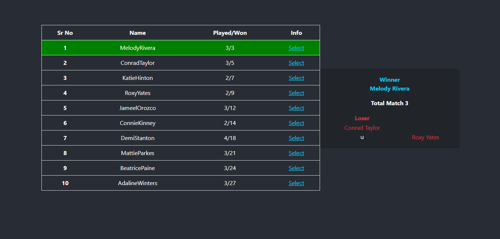

# Project: Live-Gaming-Stats

 [Click here to show](https://live-gaming-stats.web.app/).

 
## How can anyone run this project: 
* clone the project first.
* cd (the project name).
* npm install.
* npm start.
* browse on http://localhost:3000

## For unit testing: 
* npm run test.
* for update: press u

## The project feature: 
* Expose provided data as two API endpoints and consume those APIs by the app.

* Participants should be displayed on the left side. Participant items show name, played games/    won games, button to confirm details.

* Clicking select link highlights the item in the list as selected and shows related played games statistics on the right side.

* On the right side, the winner's name is always displaying first. 

* Clicking a name on either left or right side opens a small modal that shows name, played games / won games, and picture.

## Project using packages:
* react
* react-dom
* react-scripts
* sweetalert
* jest

# Author Details:
* Name: Nisar Makdum.
* Date: 25 September 2021.